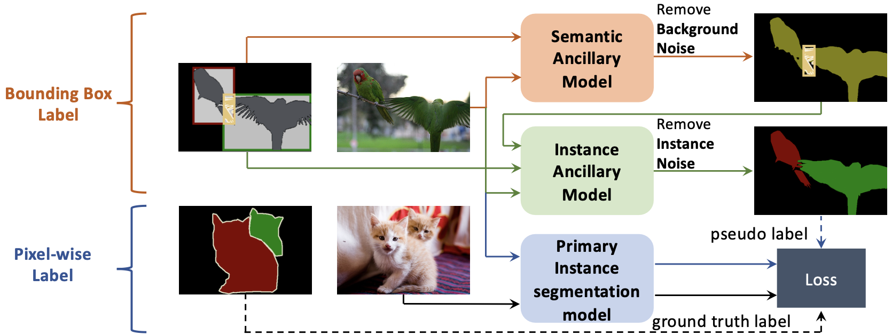

# Hybrid Supervised Instance Segmentation by Learning Label Noise Suppression

```
Linwei Chen, Ying Fu*, Shaodi You and Hongzhe Liu
```

------

[**Paper**](https://www.sciencedirect.com/science/article/pii/S0925231222005574)

------

**Abstract**

Current fully supervised instance segmentation methods severely rely on the large amounts of pixel-wise annotations that are usually expensive and time-consuming to obtain. Though weakly or semi-supervised methods utilize cheap bounding box labeled, image-level labeled or unlabeled samples to save the labeling cost, their performance is largely sacrificed. To save labeling cost without losing much performance, in this paper, we present a pipeline which can utilize economical bounding box labels and clear pixel-wise labels in a hybrid way. Specifically, we design two ancillary models to learn label noise suppression and obtain accurate pseudo pixel-wise labels from bounding box labels for training. One is designed to suppress mislabeling between foreground and background, and the other is designed to suppress noise from mislabeling of instances. Moreover, we exploit category-aware spatial attention module, category constraint module, instance constraint module, and self-learning training approach to improve the accuracy of pseudo labels. Experiments on PASCAL VOC 2012 and Cityscapes datasets show that our method can achieve competitive performance with much less labeling cost.




## Citation

If you use our code for research, please ensure that you cite our paper:

> ```
> @article{chen2022hybrid,
>   title={Hybrid supervised instance segmentation by learning label noise suppression},
>   author={Chen, Linwei and Fu, Ying and You, Shaodi and Liu, Hongzhe},
>   journal={Neurocomputing},
>   volume={496},
>   pages={131--146},
>   year={2022},
>   publisher={Elsevier}
> }        
> ```


## Questions

If you have any questions, please email to chenlinwei@bit.edu.cn.
